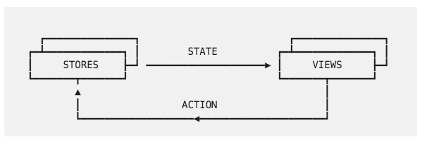

# StateX

StateX is a state management library for modern web applications with unidirectional data flow and immutable uni-state. StateX is a predictable state container just like REDUX. It helps you implement a unidirectional data flow (Flux architecture) in an easy and elegant way without much boilerplate code. The main objective is to provide an implementation that has minimal touch points, while providing all the benefits of Redux. StateX uses `rxjs` library at its heart, hence promises efficient data flow. StateX is inspired by [refluxjs](https://github.com/reflux/refluxjs) and [redux](http://redux.js.org/).

To enable seamless integration, StateX has specific APIs for [Angular (2 or above)](https://angular.io) and [React](https://facebook.github.io/react/).

**Note: StateX was originally written for angular - [ angular-reflux ]( https://github.com/rintoj/angular-reflux ) and later modified for react - [react-reflux]( https://github.com/rintoj/react-reflux ). Both of these packages are now migrated to StateX**

- [StateX](#statex)
- [Architecture](#architecture)
- [Install](#install)
- [Usage](#usage)
- [Examples](#examples)
- [5 Simple Steps](#5-simple-steps)
  * [1. Define State](#1-define-state)
  * [2. Define Action](#2-define-action)
    + [Using TypeScript](#using-typescript)
    + [Using ES6](#using-es6)
  * [3. Create Store & Bind Action](#3-create-store--bind-action)
    + [Angular with Decorator (Recommended)](#angular-with-decorator-recommended)
    + [Angular without Decorator](#angular-without-decorator)
    + [React - TypeScript with Decorators (Recommended)](#react---typescript-with-decorators-recommended)
    + [React - ES6 with Decorators](#react---es6-with-decorators)
    + [React - ES6 without Decorators](#react---es6-without-decorators)
  * [4. Dispatch Action](#4-dispatch-action)
  * [5. Consume Data](#5-consume-data)
    + [Angular with Decorator (Recommended)](#angular-with-decorator-recommended-1)
    + [Angular without Decorator](#angular-without-decorator-1)
    + [React - TypeScript & Decorators (Recommended)](#react---typescript--decorators-recommended)
    + [React - ES6 & Decorators](#react---es6--decorators)
    + [React - ES6 and without Decorator](#react---es6-and-without-decorator)
- [Organizing Stores](#organizing-stores)
  * [Angular](#angular)
  * [React - TypeScript / ES6](#react---typescript--es6)
- [Reducer Functions & Async Tasks](#reducer-functions--async-tasks)
- [Initialize State & Enable HotLoad](#initialize-state--enable-hotload)
  * [Angular](#angular-1)
  * [React](#react)
- [Immutable Application State](#immutable-application-state)
- [Migrating](#migrating)
  * [Migrating from angular-reflux](#migrating-from-angular-reflux)
  * [Migrating from react-reflux](#migrating-from-react-reflux)
- [About](#about)
  * [Contributing](#contributing)
  * [Author](#author)
  * [Versions](#versions)
  * [License](#license)

# Architecture

Flux is an architecture for unidirectional data flow. By forcing the data to flow in a single direction, Flux makes it easy to reason *how data-changes will affect the application* depending on what actions have been issued. The components themselves may only update  application-wide data by executing an action to avoid double maintenance nightmares.



* **STATE** - contains application wide data. Technically this is a single immutable JavaScript object containing every data that an application needs.

* **STORES** - contain business logic - how an action should transform the application wide data represented by `STATE`

* **VIEWS** - Views must react to the change in `STATE`. So an event is triggered when `STATE` changes, which `VIEWS` can consume to update itself with the new data.

* **ACTIONS** - are dispatched whenever a view needs to change application state. The actions contain payload to help store complete the updates.

# Install
```
npm install statex --save
```

# Usage

StateX works with any modern JavaScript framework, however there are minor differences to how it is implemented for each framework.

This guide includes instructions to integrate StateX with the following combinations of frameworks and features

| Framework | Language         | Decorator |               |
|-----------|------------------|-----------|---------------|
| Angular   | TypeScript       | YES       | (Recommended) |
| Angular   | TypeScript       | NO        |               |
| React     | TypeScript       | YES       | (Recommended) |
| React     | ES6              | YES       |               |
| React     | ES6              | NO        |               |

> Use [@angular/cli](http://npmjs.com/package/@angular/cli) to get started with Angular

> Use [react-ts](https://github.com/rintoj/react-ts) to get started with React & TypeScript

> Use [create-react-app](https://www.npmjs.com/package/create-react-app) to get started with React & ES6

or use one of the following examples

# Examples

* [Angular with TypeScript & Decorators - AOT Compatible](https://github.com/rintoj/statex/tree/master/examples/todo-ng-ts)
* [Angular with TypeScript & without Decorators - AOT Compatible](https://github.com/rintoj/statex/tree/master/examples/todo-ng-wo-decorators)
* [React with TypeScript & Decorators](https://github.com/rintoj/statex/tree/master/examples/todo-react-ts)
* [React with ES6 & Decorators](https://github.com/rintoj/statex/tree/master/examples/todo-react-es6)
* [React with ES6 & without Decorators](https://github.com/rintoj/statex/tree/master/examples/todo-react-es6-wo-decorators)

# 5 Simple Steps

## 1. Define State
To get the best out of TypeScript, declare an interface that defines the structure of the application-state. This is optional if you don't want to use TypeScript.

```ts
export interface Todo {
  id?: string
  title?: string
  completed?: boolean
}

export type Filter = 'ALL' | 'ACTIVE' | 'COMPLETED'

export interface AppState {
  todos?: Todo[]
  filter?: Filter
}
```

## 2. Define Action

Define actions as classes with the necessary arguments passed on to the constructor. This way we will benefit from the type checking; never again we will miss-spell an action, miss a required parameter or pass a wrong parameter. Remember to extend the action from `Action` class. This makes your action listenable and dispatch-able.

### Using TypeScript

```ts
import { Action } from 'statex';

export class AddTodoAction extends Action {
  constructor(public todo: Todo) {
    super()
  }
}
```

### Using ES6

```ts
import { Action } from 'statex';

export class AddTodoAction extends Action {
  constructor(todo) {
    super()
    this.todo = todo
  }
}
```

## 3. Create Store & Bind Action

Stores are the central part of a Flux architecture. While most of the logics for a store are same, some of the minor details vary from framework to framework.

### Angular with Decorator (Recommended)

Use `@action` decorator to bind a reducer function with an Action. The second parameter to the reducer function (`addTodo`) is an action (of type `AddTodoAction`); `@action` uses this information to bind the correct action. Also remember to extend this class from `Store`.

```ts
import { Injectable } from '@angular/core'
import { action, Store } from 'statex/angular'

@Injectable()
export class TodoStore extends Store {

  @action()
  addTodo(state: AppState, payload: AddTodoAction): AppState {
    return { todos: state.todos.concat([payload.todo]) }
  }
}
```

### Angular without Decorator

```ts
import { Injectable } from '@angular/core'

@Injectable()
export class TodoStore {

  constructor() {
    new AddTodoAction(undefined).subscribe(this.addTodo, this)
  }

  addTodo(state: AppState, payload: AddTodoAction): AppState {
    return { todos: state.todos.concat([payload.todo]) }
  }
}
```

This store will be instantiated by Angular's dependency injection.

### React - TypeScript with Decorators (Recommended)

Use `@action` decorator to bind a reducer function with an Action. The second parameter to the reducer function (`addTodo`) is an action (of type `AddTodoAction`); `@action` uses this information to bind the correct action.

```ts
import { AppState } from '../state';
import { AddTodoAction } from '../action';
import { action, store } from 'statex/react';

@store()
export class TodoStore {

  @action()
  addTodo(state: AppState, payload: AddTodoAction): AppState {
    return { todos: state.todos.concat([payload.todo]) }
  }
}
```

Stores must bind each action with the reducer function at the startup and also must have a singleton instance. Both of these are taken care by `@store` decorator.

### React - ES6 with Decorators

```ts
import { AddTodoAction } from '../action';
import { action, store } from 'statex/react';

@store()
export class TodoStore {

  @action(AddTodoAction)
  addTodo(state, payload) {
    return { todos: state.todos.concat([payload.todo]) }
  }
}
```

`@action` takes an optional parameter - the action class. Always remember to add `@store()` to the class.

### React - ES6 without Decorators

```ts
import { AddTodoAction } from '../action';

export class TodoStore {

  constructor() {
    new AddTodoAction().subscribe(this.addTodo, this)
  }

  addTodo(state, payload) {
    return { todos: state.todos.concat([payload.todo]) }
  }
}

new TodoStore()
```

Remember to instantiate the store at the end.

## 4. Dispatch Action

No singleton dispatcher! Instead StateX lets every action act as dispatcher by itself. One less dependency to define, inject and maintain.

```ts
new AddTodoAction({ id: 'sd2wde', title: 'Sample task' }).dispatch();
```

## 5. Consume Data

Use `@data` decorator and a selector function (parameter to the decorator) to get updates from application state. The property gets updated only when the value returned by the selector function changes from previous state to the current state. Additionally, just like a map function, you could map the data to another value as you choose.

We may, at times need to derive additional properties from the data, sometimes using complex calculations. Therefore `@data` can be used with functions as well.

See framework specific implementation.

### Angular with Decorator (Recommended)

While creating an Angular component, remember to extend it from `DataObserver`. It is essential to instruct Angular Compiler to keep `ngOnInit` and `ngOnDestroy` life cycle events, which can only be achieved by implementing `OnInit` and `OnDestroy` interfaces. `DataObserver` is  responsible for subscribing to state stream when the component is created and for unsubscribing when the component is destroyed. The selector function must also be kept as external functions accessible to outside modules, therefore add `export` to every selector function.

```ts
import { data, DataObserver } from 'statex/angular';

export const selectState = (state: AppState) => state
export const selectTodos = (state: AppState) => state.todos
export const computeHasTodos = (state: AppState) => state.todos && state.todos.length > 0

@Component({
    ....
})
export class TodoListComponent extends DataObserver {

  @data(selectTodos)     // mapping a direct value from state
  todos: Todo[];

  @data(computeHasTodos) // mapping a different value from state
  hasTodos: boolean;

  @data(selectState)     // works with functions to allow complex calculations
  todosDidChange(state: AppState) {
    // you logic here
  }

}
```

### Angular without Decorator

StateX can also be used without decorators as shown below, however this is not a recommended way. At most care must be taken to unsubscribe all the events on destroy.

```ts
import { State } from 'statex'
import { Subscription } from 'rxjs/Subscription'

export const selectTodos = (state: AppState) => state.todos
export const selectFilter = (state: AppState) => state.filter

@Component({
  ...
})
export class AppComponent implements OnInit, OnDestroy {

  todos: Todo[]
  filter: Filter
  subscriptions: Subscription[] = []

  ngOnInit() {
    this.subscriptions.push(
      State.select(selectTodos).subscribe(todos => this.todos = todos)
    )
    this.subscriptions.push(
      State.select(selectFilter).subscribe(filter => this.filter = filter)
    )
  }

  ngOnDestroy() {
    this.subscriptions.forEach(subscription => subscription.unsubscribe())
    this.subscriptions = []
  }
}
```

### React - TypeScript & Decorators (Recommended)

Create `Props` class, add properties decorated with `@data`, and finally inject the `Props` to the container using `@inject` decorator.

```tsx
import * as React from 'react'
import { data, inject } from 'statex/react'

class Props {
  @data((state: AppState) => state.todos)
  todos: Todo[]

  @data((state: AppState) => state.todos && state.todos.length > 0)
  hasTodos: boolean
}

interface State { }

@inject(Props)
export class TodoListComponent extends React.Component<Props, State> {

  render() {
    const todos = this.props.todos.map(
      todo => <li key={todo.id}>{todo.text}</li>
    )
    return <div> { this.props.hasTodos && <ul> {todos} </ul> } </div>
  }
}
```

### React - ES6 & Decorators

Create `Props` class, add properties decorated with `@data`, and finally inject the `Props` to the container using `@inject` decorator.

```tsx
import * as React from 'react'
import { inject } from 'statex/react'

@inject({
  todos: state => state.todos,
  hasTodos: state => state.todos && state.todos.length > 0
})
export class TodoListComponent extends React.Component {

  render() {
    const todos = this.props.todos.map(
      todo => <li key={todo.id}>{todo.text}</li>
    )
    return <div> { this.props.hasTodos && <ul> {todos} </ul> } </div>
  }
}
```

### React - ES6 and without Decorator

```tsx
import React from 'react'
import { State } from 'statex';

export class TodoListComponent extends React.Component {

  subscriptions = [];

  constructor(props) {
    super(props)
    this.state = {
      todos: [],
      hasTodos: false
    }
  }

  componentDidMount() {
    this.subscriptions.push(
      State.select(selectTodos).subscribe(todos => this.setState({ todos }))
    )
    this.subscriptions.push(
      State.select(computeHasTodos).subscribe(hasTodos => this.setState({ hasTodos }))
    )
  }

  componentWillUnmount() {
    this.subscriptions.forEach(subscription => subscription.unsubscribe())
    this.subscriptions = []
  }

  render() {
    const todos = this.state.todos.map(
      todo => <li key={todo.id}>{todo.text}</li>
    )
    return <div> { this.state.hasTodos && <ul> {todos} </ul> } </div>
  }

}
```

# Organizing Stores

## Angular

* Create `STORES` array and a class `Stores` (again injectable) to maintain stores.

```ts
import { Injectable } from '@angular/core';
import { TodoStore } from './todo.store';

@Injectable()
export class Stores {
  constructor( private todoStore: TodoStore) { }
}

export const STORES = [
  Stores,
  TodoStore
];
```

> When you create a new store remember to inject to the `Stores`'s constructor and add it to the `STORES` array.

* Add `STORES` to the `providers` in `app.module.ts`.

```ts
import { STORES } from './store/todo.store';

@NgModule({
  providers: [
    ...STORES
  ],
  bootstrap: [AppComponent]
})
export class AppModule { }
```

* And finally, inject `Stores` into your root component (`app.component.ts`)

```ts
@Component({
  ....
})
export class AppComponent {
  constructor(private stores: Stores) { }
}
```

## React - TypeScript / ES6

Create `index.ts` in `stores` folder and import all stores. You must do this every store you create.

```ts
import './todo-store'
```

Import stores into application (`app.tsx`), so that application is aware of the stores. This has to be done once at the beginning of the setup. Next time you create a new store, it must only be added to `store/index.ts`

```ts
import './stores'
...
export class AppComponent extends React.Component<{}, {}> {
  ...
}
```

# Reducer Functions & Async Tasks

Reducer functions can return either of the following

* A portion of the application state as plain object

```ts
@action()
add(state: AppState, payload: AddTodoAction): AppState {
  return {
    todos: (state.todos || []).concat(payload.todo)
  }
}
```

* A port of the application state using async and await (RECOMMENDED)
```ts
@action()
async add(state: AppState, payload: AddTodoAction): Promise<AppState> {
  const response = await asyncTask();
  return (currentState: AppState) => ({
    todos: (currentState.todos || []).concat(response.todo)
  })
}
```

> Please note: the state might change by the time the `asyncTask()` is completed. So it is recommended to return a function that will receive the current state as shown above. Do all calculations based on `currentState` instead of `state`

* A portion of the application state wrapped in Promise, if it needs to perform an async task.
```ts
@action()
add(state: AppState, payload: AddTodoAction): Promise<AppState> {
  return new Promise((resolve, reject) => {
    asyncTask().then(() => {
      resolve((currentState: AppState) => ({
        todos: (currentState.todos || []).concat(payload.todo)
      }))
    })
  })
}
```

* A portion of the application state wrapped in Observables, if the application state needs update multiple times over a period of time, all when handling an action. For example, you have to show loader before starting the process, and hide loader after you have done processing, you may use this.

```ts
import { Observable } from 'rxjs/Observable'
import { Observer } from 'rxjs/Observer'

@action()
add(state: AppState, payload: AddTodoAction): Observable<AppState> {
  return Observable.create((observer: Observer<AppState>) => {
    observer.next({ showLoader: true })
    asyncTask().then(() => {
      observer.next((currentState: AppState) => ({
        todos: (currentState.todos || []).concat(payload.todo),
        showLoader: false
      }))
      observer.complete()
    })
  })
}
```

# Initialize State & Enable HotLoad

You can initialize the app state using the following code.

## Angular

```ts
...
import { INITIAL_STATE } from './../state'
import { environment } from '../environments/environment'
import { initialize } from 'statex/angular'

initialize(INITIAL_STATE, {
  hotLoad: !environment.production,
  domain: 'my-app'
})

@NgModule({
  ....
  bootstrap: [AppComponent]
})
export class AppModule { }
```

## React

```ts
...
import { INITIAL_STATE } from './../state'
import { initialize } from 'statex/react'

initialize(INITIAL_STATE, {
  hotLoad: process.env.NODE_ENV !== 'production',
  showError: process.env.NODE_ENV !== 'production',
  domain: 'my-app'
})

import { AppComponent } from './app'
ReactDOM.render(<AppComponent />, document.getElementById('root'))
```

If you set `hotLoad` to true, every change to the state is preserved in localStorage and re-initialized upon refresh. If a state exists in localStorage `INITIAL_STATE` will be ignored. This is useful for development builds because developers can return to the same screen after every refresh. Remember that the screens must react to state (reactive UI) in-order to achieve this. `domain` is an optional string to uniquely identify your application. `showError`, if set to true, displays console errors when the actions are rejected.

# Immutable Application State
To take best use of React's and Angular's change detection strategies we need to ensure that the state is indeed immutable. This module uses [seamless-immutable](https://github.com/rtfeldman/seamless-immutable) for immutability.

Since application state is immutable, the reducer functions will not be able to update state directly; any attempt to update the state will result in error. Therefore a reducer function should either return a portion of the state that needs change (recommended) or a new application state wrapped in `ReplaceableState`, instead.

```ts
@action()
selectTodo(state: AppState, payload: SelectTodoAction): AppState {
  // merge with the existing state
  return {
    selectedTodo: payload.todo
  }
}

@action()
resetTodos(state: AppState, payload: ResetTodosAction): AppState {
  // replace the current state completely with the new one
  return new ReplaceableState({
    todos: [],
    selectedTodo: undefined
  })
}
```

# Migrating

## Migrating from angular-reflux

* Replace `angular-reflux` package with `statex`

```bash
npm uninstall react-reflux --save
npm install statex --save
```
* Replace imports from `angular-reflux` to `statex/angular`

```ts
// from
import { data, DataObserver } from 'angular-reflux'

// to
import { data, DataObserver } from 'statex/angular'
```

* Change `@BindAction()` to `@action()`

```ts
// from
@BindAction()
addTodo(state: AppState, action: AddTodoAction): AppState {
  ...
}

// to
@action()
addTodo(state: AppState, action: AddTodoAction): AppState {
  ...
}
```

* Change `@BindData()` to `@data()`
```ts
// from
@Component({...})
export class AppComponent extends DataObserver {
  @BindData(selectTodos)
  todos: Todo[]
}

// to
@Component({...})
export class AppComponent extends DataObserver {
  @data(selectTodos)
  todos: Todo[]
}
```

## Migrating from react-reflux

To migrate to StateX replace the package `react-reflux` with `statex`.

```bash
npm uninstall react-reflux --save
npm install statex --save
```

And change every import statement from `react-reflux` to `statex/react`. That's all

```ts
// from
import { data, inject } from 'react-reflux'

// to
import { data, inject } from 'statex/react'
```
# About

### Hope StateX is helpful to you. Please make sure to checkout my other [projects](https://github.com/rintoj) and [articles](https://medium.com/@rintoj). Enjoy coding!

## Contributing
Contributions are very welcome! Just send a pull request. Feel free to contact [me](mailto:rintoj@gmail.com) or checkout my [GitHub](https://github.com/rintoj) page.

## Author

**Rinto Jose** (rintoj)

Follow me:
  [GitHub](https://github.com/rintoj)
| [Facebook](https://www.facebook.com/rinto.jose)
| [Twitter](https://twitter.com/rintoj)
| [Google+](https://plus.google.com/+RintoJoseMankudy)
| [Youtube](https://youtube.com/+RintoJoseMankudy)

## Versions
[Check CHANGELOG](https://github.com/rintoj/statex/blob/master/CHANGELOG.md)

## License
```
The MIT License (MIT)

Copyright (c) 2017 Rinto Jose (rintoj)

Permission is hereby granted, free of charge, to any person obtaining a copy
of this software and associated documentation files (the "Software"), to deal
in the Software without restriction, including without limitation the rights
to use, copy, modify, merge, publish, distribute, sublicense, and/or sell
copies of the Software, and to permit persons to whom the Software is
furnished to do so, subject to the following conditions:

The above copyright notice and this permission notice shall be included in
all copies or substantial portions of the Software.

THE SOFTWARE IS PROVIDED "AS IS", WITHOUT WARRANTY OF ANY KIND, EXPRESS OR
IMPLIED, INCLUDING BUT NOT LIMITED TO THE WARRANTIES OF MERCHANTABILITY,
FITNESS FOR A PARTICULAR PURPOSE AND NONINFRINGEMENT. IN NO EVENT SHALL THE
AUTHORS OR COPYRIGHT HOLDERS BE LIABLE FOR ANY CLAIM, DAMAGES OR OTHER
LIABILITY, WHETHER IN AN ACTION OF CONTRACT, TORT OR OTHERWISE, ARISING FROM,
OUT OF OR IN CONNECTION WITH THE SOFTWARE OR THE USE OR OTHER DEALINGS IN
THE SOFTWARE.
```
