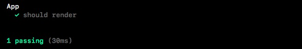
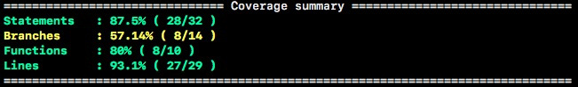

# React App in TypeScript

This project is generated using [`react-ts`](https://www.npmjs.com/package/react-ts) command line interface.

## About

This project is configured with
  - [TypeScript](https://www.typescriptlang.org/)
  - [WebPack](https://webpack.js.org/)
  - [Hot Module Replacement](https://webpack.js.org/concepts/hot-module-replacement/) with app state preservation
  - [React Reflux](https://github.com/rintoj/react-reflux) - (an implementation of flux)
  - [Mocha](https://mochajs.org/) & [Chai](http://chaijs.com/) for testing

## Usage

```bash

  ## development
  npm start           # Serve the project

  ## test
  npm test            # Run test suite
  npm run tdd         # Run test suite in watch mode
  npm run lint        # Test for lint error

  ## build
  npm run build       # Create production build
  npm run build:dev   # Create development build

```

# Get Started with Reflux

**React reflux** is a predictable state container for React apps just like REDUX. It helps you implement a unidirectional data flow (Flux architecture) in an easy and elegant way without much boilerplate code. The main objective of this module is to provide an implementation that has minimal touch points, while providing all the benefits of Redux. This is inspired by [refluxjs](https://github.com/reflux/refluxjs), [redux](http://redux.js.org/) & [angular-reflux](https://github.com/rintoj/angular-reflux) and uses TypeScript decorators. This module derives many of it's features from MobX (flow is shown below).


## 5 Simple Steps

### 1. Define State
To get the best out of TypeScript, declare interfaces that defines the structure of the application-state.

```ts
export interface Todo {
  id?: string;
  text?: string;
  completed?: boolean;
}

export interface AppState {
  todos?: Todo[];
  selectedTodo?: Todo;
}
```

### 2. Define Action
Define actions as classes with the necessary arguments passed on to the constructor. This way we will benefit from the type checking; never again we will miss-spell an action, miss a required parameter or pass a wrong parameter. Remember to extend the action from `Action` class. This makes your action listenable and dispatch-able.

```ts
import { Action } from 'react-reflux';

export class AddTodoAction extends Action {
  constructor(public todo: Todo) { super(); }
}
```

### 3. Create Store & Bind Action
Use `@action` decorator to bind a reducer function with an Action. The second parameter to the reducer function (`addTodo`) is an action (of type `AddTodoAction`); `@action` uses this information to bind the correct action. Also remember to decorate this class with `@store`.

```ts
import { AppState } from '../state';
import { AddTodoAction } from '../action';
import { action, store } from 'react-reflux';

@store
export class TodoStore {

  @action
  addTodo(state: AppState, action: AddTodoAction): AppState {
    return { todos: state.todos.concat([action.todo]) }
  }
}
```

Did you notice `@store`? Well, stores must bind each action with the reducer function at the startup and also must have a singleton instance. Both of these are taken care by `@store` decorator. Read [Organizing Stores](#organizing-stores) to understand more.

### 4. Dispatch Action

No singleton dispatcher! Instead this module lets every action act as dispatcher by itself. One less dependency to define, inject and maintain.

```ts
new AddTodoAction({
  id: 'sd2wde',
  text: 'Sample task'
}).dispatch();
```

### 5. Consume Data

Use `@data` decorator and a selector function (parameter to the decorator) to get updates from application state. The property gets updated only when the value returned by the selector function, changes from previous state to the current state. Additionally, just like a map function, you could map the data to another value as you choose.

```ts
import * as React from 'react'
import { data, inject } from 'react-reflux'

class Props {
  @data((state: AppState) => state.todos)
  todos: Todo[]

  @data((state: AppState) => state.todos && state.todos.length > 0)
  hasTodos: boolean
}

interface State { }

@inject(Props)
export class TodoListComponent extends React.Component<Props, State> {

  render() {
    const todos = this.props.todos.map(
      todo => <li key={todo.id}>{todo.text}</li>
    )

    return <div>
      { this.props.hasTodos && <ul> {todos} </ul> }
    </div>
  }
}
```

## Reducer Functions & Async Tasks

Reducer functions can return either of the following

1. A portion of the application state as plain object
```ts
@action
add(state: AppState, action: AddTodoAction): AppState {
  return {
    todos: (state.todos || []).concat(action.todo)
  }
}
```

2. A portion of the application state wrapped in Promise, if it needs to perform an async task.
```ts
@action
add(state: AppState, action: AddTodoAction): Promise<AppStore> {
  return new Promise((resolve, reject) => {
    asyncTask().then(() => {
      resolve({
        todos: (state.todos || []).concat(action.todo)
      })
    })
  })
}
```

3. A portion of the application state wrapped in Observables, if the application state needs update multiple times over a period of time, all when handling an action. For example, you have to show loader before starting the process, and hide loader after you have done processing, you may use this.
```ts
@action
add(state: AppState, action: AddTodoAction): Observable<AppState> {
  return Observable.create((observer: Observer<AppState>) => {
    observer.next({ showLoader: true })
    asyncTask().then(() => {
      observer.next({
        todos: (state.todos || []).concat(action.todo),
        showLoader: false
      })
      observer.complete()
    })
  })
}
```

## Immutable Application State
To take advantage of React's change detection strategy we need to ensure that the state is indeed immutable. This module uses [seamless-immutable](https://github.com/rtfeldman/seamless-immutable) for immutability.

Since application state is immutable, the reducer functions will not be able to update state directly; any attempt to update the state will result in error. Therefore a reducer function should either return a portion of the state that needs change (recommended) or a new application state wrapped in `ReplaceableState`, instead.

```ts
@store
export class TodoStore {

  @action
  selectTodo(state: AppState, action: SelectTodoAction): AppState {
    return {
      selectedTodo: action.todo
    }
  }

  @action
  resetTodos(state: AppState, action: ResetTodosAction): AppState {
    return new ReplaceableState({
      todos: [],
      selectedTodo: undefined
    })
  }
}
```

## Organizing Stores

All stores must be decorated with `@store` and must be imported into application.

1. Create `index.ts` in `stores` folder and import all stores
```ts
import './todo-store'
```

2. Import stores into application (`app.tsx`)
```ts
import './stores'

...
export class AppComponent extends React.Component<{}, {}> {
  ...
}
```

# Testing

## Write Unit Test

Create a file with extension `.spec.ts{x}` at the same directory as the module your are trying to test. A sample test suite may be as below:

```ts
import fontWeights from './fontWeights'

describe('fontWeights', () => {
  it('should be defined', () => {
    expect(fontWeights).toBeDefined()
  })

  it('should contain normal', () => {
    expect(fontWeights.normal).toBeDefined()
  })

  it('should contain b', () => {
    expect(fontWeights.b).toBeDefined()
  })

  it('should contain fw1 to fw9 styles', () => {
    for (let index = 1; index <= 9; index++) {
      expect((fontWeights as any)[`fw${index}`]).toBeDefined()
    }
  })
})
```

## Run Unit Test

You can run the test suite once with the following command:

```bash
npm test  # 'npm t' will also work
```

If everything is successful you should see report like this:



## Test Driven Development (TDD)

You can run tests in watch mode using the following command:

```bash
npm run tdd  # run tests in watch mode.
```

This will ensure that the tests are run every time you make changes to the source code or to the test suites.

## Code Coverage Report

Test suite scripts also take care of capturing the code coverage report. It is desirable to get all items to green. A sample report will look like this:



You can also access an html version of this report at [./coverage/lcov-report/index.html](coverage/lcov-report/index.html) (only from your local machine - coverage reports are not checked in)